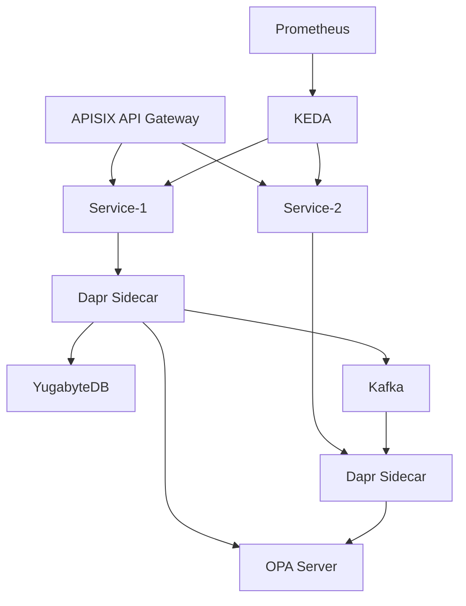

# Architecture Diagram

```mermaid
graph TD
    A[APISIX API Gateway] --> B[Service-1]
    A --> C[Service-2]
    B --> D[Dapr Sidecar]
    C --> E[Dapr Sidecar]
    D --> F[YugabyteDB]
    D --> G[Kafka]
    G --> E
    D --> H[OPA Server]
    E --> H
    I[KEDA] --> B
    I --> C
    J[Prometheus] --> I
```